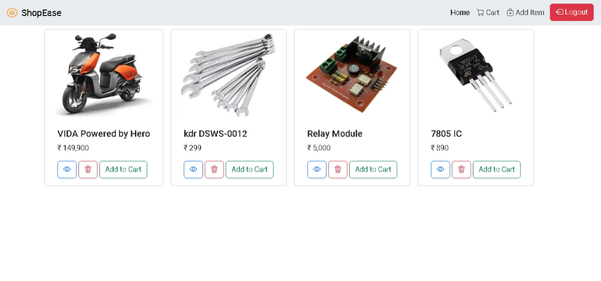
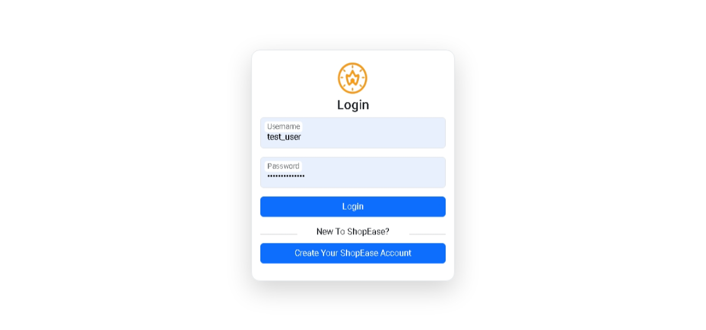
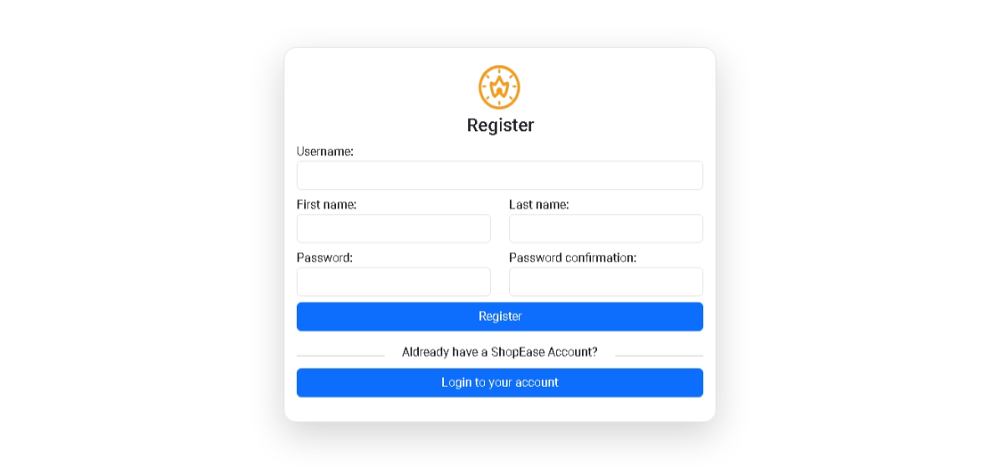
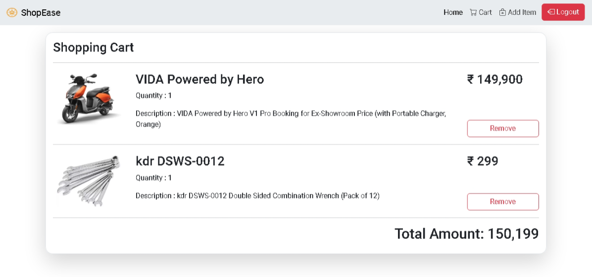
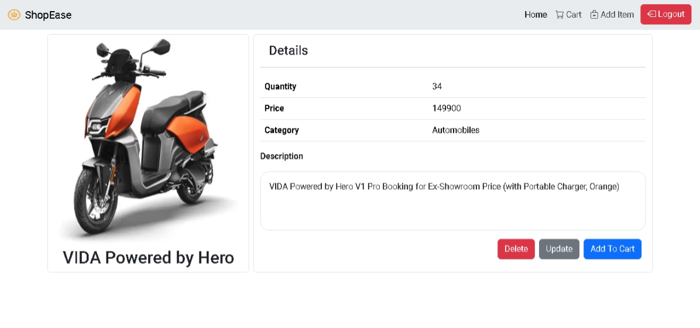
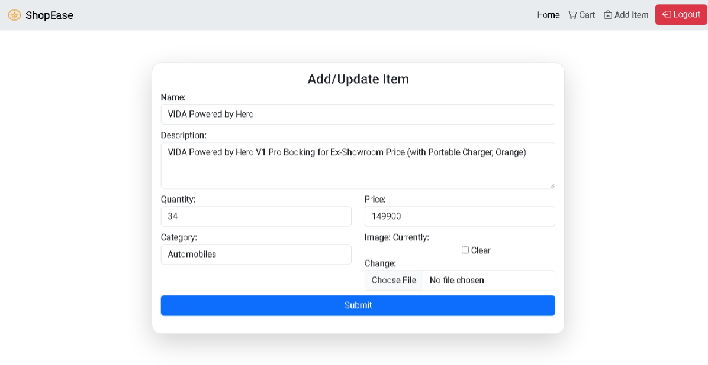

# EasyShop
A simple e-commerce application built using Django 3.0+, featuring user authentication, a dynamic shopping cart, and complete product management.

## Images

# Home Page


# Login Page


# Registration Page


# Cart Page


# Detail View 


# Add and Update View 


## Setting up environment

### Prerequisites

Before starting, ensure you have the following installed on your system:

- Python (preferably version 3.11.7 or above)
- Pip (Python package installer)
- Virtual environment (optional but recommended for creating isolated Python environments)

**Step 1: Create a Virtual Environment**

> [!CAUTION]
> Not creating a virtual environment can lead to project instability.

Creating a virtual environment helps isolate your project dependencies from other Python projects on your system. To create a virtual environment, run the following commands in your terminal:

1. Create a virtual environment named 'venv'
    ```bash
    python -m venv venv
    ```
2. Activating the environment

- For windows
    ```bash
    venv\Scripts\activate
    ```
- For macOS and Linux
    ```bash
    source venv/bin/activate
    ```

**Step 2: Installing all the required libraries**

Now that you have a virtual environment set up, you can install Django and other libraries required within the project:

```bash
pip install -r requirements.txt
```

**Step 3: Running the project in your local system**

Before running ensure that the :
1. Virtual Environment is activated

Run Migrations

```bash
python manage.py migrate
```

Then a super user has to be created
```bash
python manage.py createsuperuser
```

Then run the program in the development server
```bash
python manage.py runserver
```